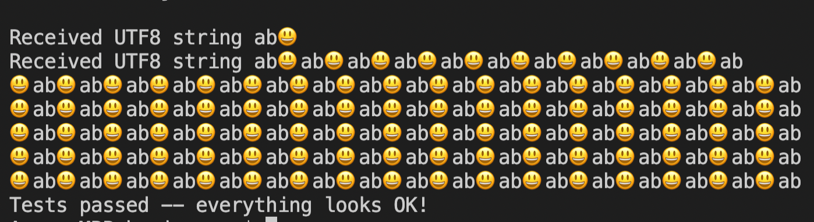

# `node-libsharedmemory`

`node-libsharedmemory` is a native Node.js module that is based on [`libsharedmemory`](https://github.com/kyr0/libsharedmemory). It can be used to read and write to shared memory on Windows, Linux and macOS. `node-libsharedmemory` makes it easy to transfer data between isolated host OS processes and Node.js applications. It also helps inter-connecting modules of applications that are implemented in different programming languages.



## Example

```js
const {
    NodeSharedMemoryWriteStream,
    NodeSharedMemoryReadStream
} = require("node-libsharedmemory");

const SHM_SEGMENT_NAME = "nameOfTheSharedMemorySegment"; // must be unique
const SHM_SEGMENT_SIZE = 65535 /* in bytes, string length * 2 */;
const SHM_PERSISTENT = true; // makes sure the memory is persisted until reboot

// this can happen in other Node.js processes or any other application
// using libsharedmemory to write data
const streamWriter = new NodeSharedMemoryWriteStream();

streamWriter.write(`{ remoteApp: { is: 'sending', data: 'ab😃ab😃ab😃' } }`, SHM_SEGMENT_NAME, SHM_SEGMENT_SIZE, SHM_PERSISTENT);

const streamReader = new NodeSharedMemoryReadStream();

const data = streamReader.read(SHM_SEGMENT_NAME, SHM_SEGMENT_SIZE, SHM_PERSISTENT);

// data equals the data written via .write() before
console.log('Data received from shared memory', data);
```

## Use

Just install it via:

`npm install node-libsharedmemory`

The example `examples/basic` should be pretty self-explanatory.

## Limits

`libsharedmemory` does only support the following datatypes:
- string

On Windows: Atm no support for shared memory persistency after the process 
that writes the memory quits.

## Build

To re-build the module from source call: `npm run rebuild`

## Test

The module can be tested via: `npm test`

```

## License

`node-libsharedmemory` is released under the MIT license, see the `LICENSE` file.

## Roadmap

1) Support for `TypedArray` (`DataView`) 
2) An `onChange()` event handling abstraction (currently needs a for-loop change detection)
3) Windows shared memory persistency support